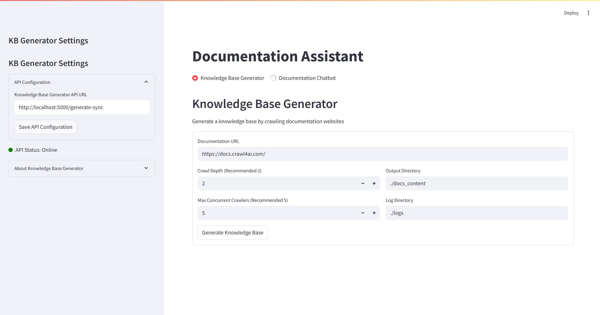

# Documentation Assistant

A comprehensive solution for generating, managing, and querying technical documentation through a user-friendly interface.



## Overview

Documentation Assistant combines two powerful tools in a single application:

1. **Knowledge Base Generator** - Crawls documentation websites to build structured knowledge bases
2. **Documentation Chatbot** - Provides natural language querying of your documentation using advanced retrieval techniques

This application uses a Flask API backend for processing and vector storage, with a Streamlit frontend for user interaction.

## Features

### Knowledge Base Generator
- Web crawler with configurable depth and concurrency
- Automatic content extraction and processing
- Generates structured knowledge base files ready for embedding

### Documentation Chatbot
- Natural language querying of technical documentation
- Advanced retrieval with neural reranking
- Conversational context for follow-up questions
- Vector database storage for efficient semantic search
- Document statistics and chunk analysis

## System Architecture

```
┌─────────────────┐     ┌─────────────────┐     ┌─────────────────┐
│                 │     │                 │     │                 │
│  Streamlit UI   │────▶│   Flask API     │────▶│  Vector Storage │
│                 │     │                 │     │                 │
└─────────────────┘     └─────────────────┘     └─────────────────┘
        ▲                      │                        ▲
        │                      ▼                        │
        │              ┌─────────────────┐              │
        │              │                 │              │
        └──────────────│    OpenAI API   │──────────────┘
                       │                 │
                       └─────────────────┘
```

- **Streamlit UI**: User interface for interacting with both tools
- **Flask API**: Backend service for knowledge base generation and document retrieval
- **Vector Storage**: Pinecone database for storing document embeddings
- **OpenAI API**: For generating embeddings and responses

## Installation

### Prerequisites
- Python 3.12
- OpenAI API key
- Pinecone API key
- Docker (optional, for containerized deployment)

### Setup

1. Clone the repository
   ```bash
   git clone https://github.com/DB00708/documentation_qa.git
   cd documentation_qa
   ```

2. Create a virtual environment
   ```bash
   python -m venv venv
   source venv/bin/activate  # On Windows: venv\Scripts\activate
   ```

3. Install dependencies
   ```bash
   pip install -r requirements.txt
   ```

4. Set up environment variables (or create a `.env` file)
   ```bash
   export OPENAI_API_KEY="your-openai-api-key"
   export PINECONE_API_KEY="your-pinecone-api-key"
   export PINECONE_INDEX="your-pinecone-index"
   ```

## Starting the Application

### 1. Start the Flask API Server

```bash
python main.py
```

The API server will start on http://localhost:5000

### 2. Start the Streamlit UI

```bash
streamlit run streamlit_app.py
```

The Streamlit UI will automatically open in your browser at http://localhost:8501

## Configuration

Both tools can be configured through the application UI:

### Knowledge Base Generator Settings
- API URL (default: http://localhost:5000/generate-sync)
- Documentation URL to crawl
- Crawl depth (recommended: 2)
- Max concurrent crawlers (recommended: 5)
- Output and log directories

### Documentation Chatbot Settings
- OpenAI API Key
- Pinecone API Key
- Pinecone Index Name
- DocBot API Base URL (default: http://localhost:5000)

## Usage Guide

### Knowledge Base Generation

1. Select the "Knowledge Base Generator" tab
2. Configure the API URL in the sidebar (if different from default)
3. Enter the documentation URL you want to crawl
4. Set the crawl depth and concurrency
5. Specify output and log directories
6. Click "Generate Knowledge Base"
7. Wait for the process to complete (this may take several minutes)

### Documentation Querying

1. Select the "Documentation Chatbot" tab
2. Configure API keys in the sidebar
3. Upload a pre-chunked JSON file of documentation chunks
   - Either use the output from the Knowledge Base Generator
   - Or provide your own properly formatted JSON file
4. Review the chunk statistics
5. Click "Load Chunks into Vector DB"
6. Start asking questions in the chat interface

## API Endpoints

The Flask API provides the following endpoints:

| Endpoint | Method | Description |
|----------|--------|-------------|
| `/generate-sync` | POST | Generates a knowledge base from a documentation URL |
| `/store-documents` | POST | Stores document chunks in the vector database |
| `/query` | POST | Queries the document database and returns a response |
| `/health` | GET | API health check endpoint |

### API Request Examples

#### Generate Knowledge Base
```json
{
  "url": "https://docs.example.com/",
  "depth": 2,
  "output_dir": "./docs_content",
  "concurrency": 5,
  "log_dir": "./logs"
}
```

#### Store Documents
```json
{
  "documents": [
    {
      "content": "Document content text",
      "url": "https://source-url.com/path",
      "chunk_length": 500
    }
  ],
  "namespace": "some-namespace"
}
```

#### Query Documents
```json
{
  "query": "How does the async webcrawler work?",
  "chat_history": [],
  "metadata_filter": {}
}
```

## Docker Deployment

A Dockerfile is provided for containerized deployment:

```bash
# Build the Docker image
docker build -t documentation_qa .

# Run the container
docker run -p 5000:5000 -p 8501:8501 \
  -e OPENAI_API_KEY="your-openai-api-key" \
  -e PINECONE_API_KEY="your-pinecone-api-key" \
  -e PINECONE_INDEX="your-pinecone-index" \
  documentation_qa
```

## Troubleshooting

### Common Issues

1. **API Connection Error**
   - Ensure the Flask API is running at the configured URL
   - Check that the correct ports are open and accessible

2. **Vector Storage Issues**
   - Verify your Pinecone API key and index name
   - Ensure your Pinecone service tier supports your document volume

3. **OpenAI API Issues**
   - Verify your OpenAI API key is valid and has sufficient quota
   - Check that you have access to the required models

## Development

### Project Structure

```
documentation_qa/
├── crawler/            # Crawls the documentation website
├── knowledge_base/     # Knowledge base generator
├── rag/                # Docbot implementation
├── resources/          # Tutorial for this Product
├── utils/              # Shared utilities
├── main.py             # Flask Server File
├── requirements.txt    # Project dependencies
├── Dockerfile          # Docker configuration
└── README.md           # This file
```

### Contributing

1. Fork the repository
2. Create a feature branch (`git checkout -b feature/amazing-feature`)
3. Commit your changes (`git commit -m 'Add some amazing feature'`)
4. Push to the branch (`git push origin feature/amazing-feature`)
5. Open a Pull Request


## Acknowledgements

- [LangChain](https://github.com/langchain-ai/langchain) - Framework for LLM applications
- [Streamlit](https://streamlit.io/) - UI framework
- [Pinecone](https://www.pinecone.io/) - Vector database
- [OpenAI](https://openai.com/) - Language models and embeddings
- [Flask](https://flask.palletsprojects.com/) - Web framework